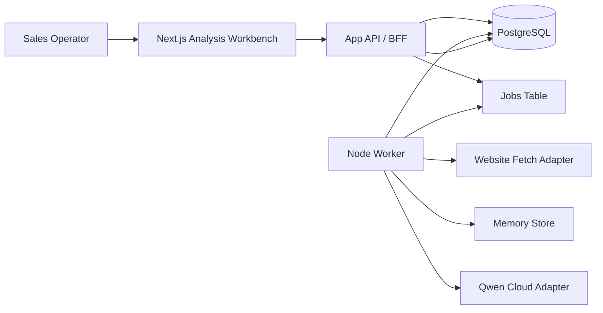
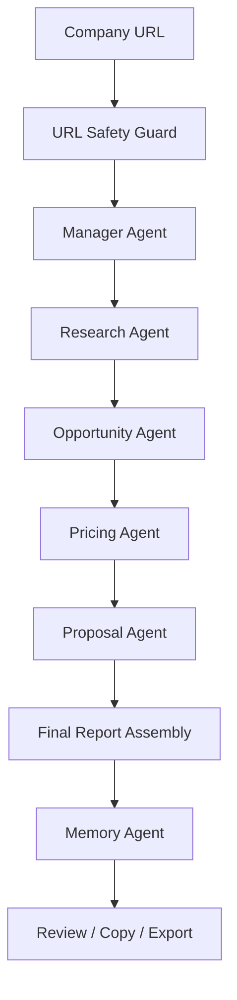

# Architecture

Status: draft

## Goal

Design the first demo for `leadpilot-ai`: a multi-agent AI sales autopilot
powered by Qwen Cloud that turns a company URL into a Business Summary,
Detected Problems, Sales Opportunity Score, Estimated Budget, Proposal Draft,
Recommended Next Steps, and Final Analysis Report.

## Project Tracks

- Primary track: Agent Society.
- Secondary track: Autopilot Agent.

## External Reference

Alibaba Cloud Model Studio documents Qwen API access through OpenAI-compatible
and DashScope protocols, including configurable regional base URLs for
chat-completion style calls:
https://www.alibabacloud.com/help/en/model-studio/use-qwen-by-calling-api

Implementation must verify the active model names, regional endpoint, and
account requirements before shipping.

## Architecture Principles

- Human-in-the-loop by default for proposals and any future outbound actions.
- Provider adapters at system boundaries: Qwen, website fetch, email,
  enrichment, CRM.
- Durable background jobs for every long-running agent action.
- Explicit memory writes for analyzed companies, prior decisions, and user
  preferences.
- Tenant isolation in data access, policies, prompts, and audit logs.
- Deterministic safety checks before website fetches and generated outputs.
- Prompt/version traceability for every AI decision.
- Start simple: one web app, one worker, one database, no distributed agent
  runtime until the product proves it needs it.

## System Context



## Runtime Components

| Component | Responsibility |
| --- | --- |
| Web dashboard | URL intake, analysis progress, report review, proposal copy/export. |
| API/BFF | Authenticated commands, validation, tenant checks, job creation. |
| PostgreSQL | Source of truth for analyses, snapshots, proposals, jobs, audits, agents. |
| Worker | Claims jobs, runs agents, calls providers, records results and retries. |
| Qwen adapter | Normalizes Qwen Cloud requests, responses, retries, and model config. |
| Website fetch adapter | Retrieves submitted public pages with SSRF, timeout, and size controls. |
| Memory store | Saves analyzed companies, prior decisions, and user preferences. |
| Email adapter | Sends approved messages and receives delivery/reply webhooks. |
| Policy engine | Deterministic checks for URL safety, source quality, and output quality. |
| Observability | Agent run records, structured logs, prompt versions, error events. |

## MVP Agent Pipeline



## Agents

| Agent | Inputs | Outputs | Notes |
| --- | --- | --- | --- |
| Manager Agent | Job, workspace config, memory context | Analysis plan, next step, final report | Coordinates the agent society and assembles the report. |
| URL Safety Guard | Submitted URL | Allowed/blocked decision | Blocks private IPs, localhost, unsafe schemes, and excessive redirects. |
| Research Agent | Website, allowed public social signals, sector | Business Summary and source notes | Uses website fetcher and content extraction internally. |
| Opportunity Agent | Business Summary and research notes | Detected Problems and improvements | Finds AI, automation, CRM, sales, marketing, ops, and support gaps. |
| Pricing Agent | Problems, scope, market assumptions | Sales Opportunity Score, complexity, ROI, budget | Produces ranges, not guarantees. |
| Proposal Agent | Summary, problems, score, budget | Proposal Draft, email, work plan, next steps | Produces editable proposal, not an automatic send. |
| Memory Agent | Analysis result and user preferences | Saved company memory and decisions | Avoids secrets and unnecessary personal data. |
| Reply Classifier | Inbound reply, prior thread context | Interested/not now/objection/unsubscribe/etc. | Human override supported. |
| CRM Scribe | Events and agent outputs | Pipeline state and notes | Writes concise structured activity. |

## Core Data Model

| Entity | Purpose |
| --- | --- |
| workspaces | Tenant boundary and subscription/account settings. |
| users | Authenticated operators and roles. |
| analyses | Submitted URL, status, timestamps, result summary, and owner. |
| website_snapshots | Retrieved page content, metadata, content hash, and fetch diagnostics. |
| company_memories | Prior analyzed companies, decisions, and user preferences. |
| detected_problems | Problems, evidence, impact, automation potential, confidence. |
| scores | Sales opportunity score, dimensions, reasons, confidence. |
| budget_estimates | Budget range, currency, package, assumptions, confidence. |
| proposals | Proposal Draft content, version, status, and export metadata. |
| reports | Final Analysis Report content, sections, markdown, and export metadata. |
| icp_profiles | Target market, personas, exclusions, fit criteria. |
| companies | Account-level firmographic and research data. |
| leads | Contact-level data, source, consent status, owner, lifecycle stage. |
| lead_lists | Imported groups and segmentation. |
| campaigns | Offer, target segment, policy, sequence configuration. |
| campaign_steps | Draft templates and timing rules. |
| messages | Drafts, approvals, outbound payloads, reply linkage. |
| approvals | Human review decisions and reviewer notes. |
| agent_runs | Agent name, prompt version, input hash, output, status, tokens, cost. |
| jobs | Background work queue with retry, lock, and dead-letter metadata. |
| suppression_list | Workspace-level unsubscribes and blocked domains/emails. |
| provider_accounts | Encrypted references for email and integration credentials. |
| audit_log | Immutable record of security-relevant actions. |

## Key Flows

### URL Analysis

1. User submits a URL such as `https://empresa.com`.
2. API validates syntax and creates an `analysis` plus `analyze_url` job.
3. Worker checks URL safety before any network request.
4. Website fetch adapter retrieves allowed public content with bounded limits.
5. Manager Agent coordinates the workflow and memory context.
6. Research Agent prepares a compact context package from the website and
   allowed public context.
7. Opportunity Agent detects problems and possible improvements.
8. Pricing Agent calculates complexity, ROI assumptions, Sales Opportunity
   Score, and Estimated Budget.
9. Proposal Agent produces Proposal Draft, email draft, work plan, and
   Recommended Next Steps.
10. Manager Agent assembles the Final Analysis Report.
11. Memory Agent saves the analyzed company, relevant decisions, and user
    preferences.
12. Results are stored with prompt versions and surfaced in the UI.

### Proposal Review

1. User reviews the result page.
2. User can copy individual sections or the full proposal.
3. User can regenerate the proposal while preserving the same website snapshot.
4. Future versions can turn the proposal into outbound email or CRM notes.

### Future Reply Handling

1. Email provider webhook posts inbound reply metadata.
2. API verifies webhook signature and stores the raw event reference.
3. Reply classifier assigns a state and confidence.
4. CRM scribe updates lead status and recommended next action.
5. Operator can override classification.

## Qwen Cloud Boundary

The application must call Qwen only through `packages/qwen`.

Provider contract:

```ts
export interface AiTextProvider {
  generateStructured<T>(request: StructuredGenerationRequest<T>): Promise<StructuredGenerationResult<T>>;
  generateText(request: TextGenerationRequest): Promise<TextGenerationResult>;
}
```

Adapter requirements:

- Read `DASHSCOPE_API_KEY`, `QWEN_BASE_URL`, and model names from env.
- Support timeouts and bounded retries.
- Enforce max input/output token budgets per agent.
- Return normalized usage metadata.
- Redact secrets before logging.
- Preserve prompt version and input hash for traceability.

## Security And Compliance

- Store secrets only in environment variables or provider secret stores.
- Encrypt provider credentials and never persist raw API keys in app tables.
- Enforce row-level tenant checks on every database query.
- Verify email webhooks with provider signatures.
- Maintain suppression list and unsubscribe handling before send.
- Log every approval, send, policy failure, and admin change.
- Do not store raw prompt inputs that contain secrets or unnecessary PII.
- Rate-limit generation and sending at workspace and provider levels.

## Deployment Topology

MVP deployment target:

```text
Vercel
  apps/web: Next.js dashboard and API

Worker host
  apps/worker: long-running Node process or scheduled worker

Supabase
  PostgreSQL, auth, migrations, storage if needed

Qwen Cloud
  Text generation and structured AI outputs

Email provider
  Future approved outbound and inbound webhooks
```

## Evolution Path

1. Demo 1: single URL analysis to proposal package.
2. Add analysis history, workspace auth, and saved proposal versions.
3. Add lead lists and CRM pipeline after proposal generation proves useful.
4. Add email approval and sending.
5. Add CRM sync adapters after internal pipeline behavior stabilizes.
6. Add autonomous low-risk follow-up only after policy and audit data mature.
