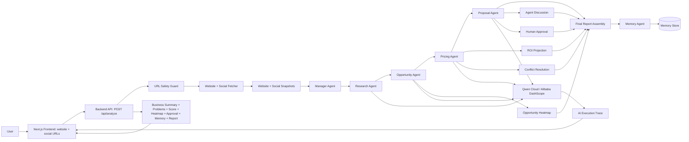

# Architecture Diagram

## Notes

- Qwen Cloud is isolated behind `QwenCloudProvider`.
- Qwen calls use structured output with JSON Schema mode when possible.
- Qwen prompts include per-agent personas for research, opportunity detection,
  pricing, and proposal generation.
- Agent trace captures provider, model, response format, latency, fallback, and
  validation state.
- The frontend visualizes agent status, conflict resolution, heatmap, human
  approval, agent discussion, score, ROI, and memory.
- Website and optional social profile fetching are isolated behind a
  safety-checked adapter.
- Memory is local JSONL in the MVP and can move to PostgreSQL or Alibaba Cloud
  storage later.
- The backend can run on Alibaba Cloud ECS, ACK, or Function Compute with the
  same environment variables.
